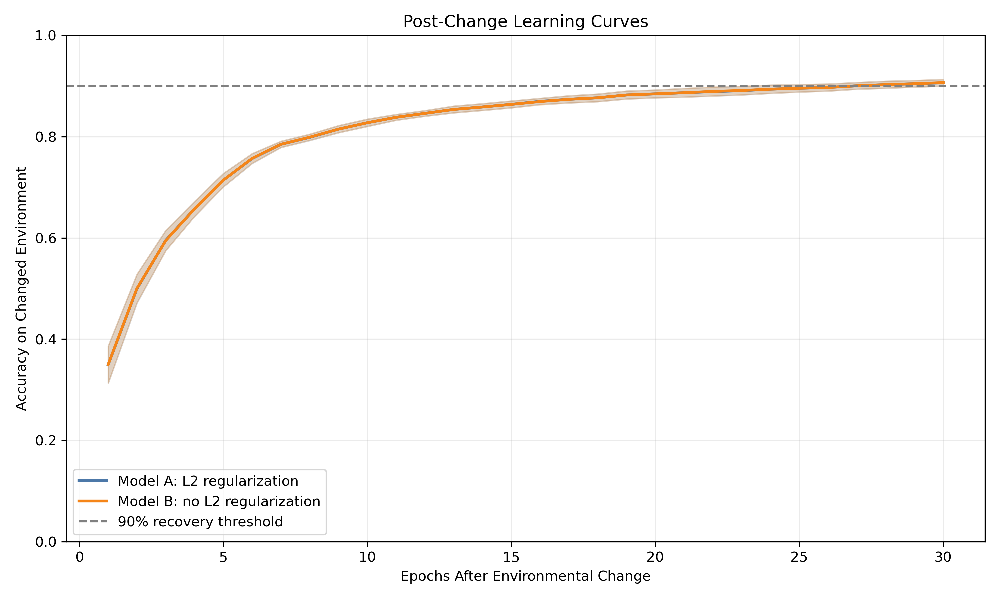
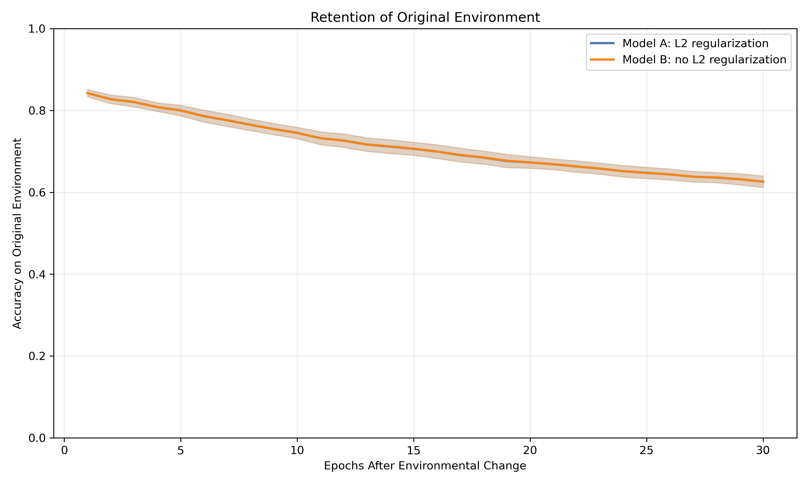

# Study

**Article:** *Plasticity Loss in Deep Reinforcement Learning: A Survey*

**Authors:** Timo Klein, Christoph Luther, Manus McAuliffe, Lukas Miklautz, Claudia Plant, and Sebastian Tschiatschek

**DOI/URL:** [https://doi.org/10.48550/arXiv.2411.04832](https://doi.org/10.48550/arXiv.2411.04832)

**Replication Type:** Proxy

**Computational Environment:** Python 3.12 using the Anaconda base environment on macOS

**Primary Packages:** NumPy, pandas, matplotlib, and scikit-learn

**Random Seeds:** Data split = 2026; pixel permutation = 517; model seeds = 11, 22, 33, 44, and 55

**Repository:** https://github.com/Parm1486/anly735-lab02-Parm1486

# 1. Research Claim

@kleinPlasticityLossDeep2026a define plasticity as a neural network’s ability to adapt quickly when data distributions or learning targets change. The survey's central concern is that a model can retain parameters and some prior capability while becoming less effective at learning what comes next. This laboratory examines the narrower behavioral claim that two models with similar pre-change performance and similar immediate disruption after an environmental change can nevertheless differ in post-change learning capacity. The relevant evidence is therefore not the size of the immediate decline alone, but the subsequent recovery trajectory: improvement rate, time required to reach a recovery threshold, and final performance under an equal post-change learning budget. The survey discusses input nonstationarity, including pixel shuffling, as a controlled way to study adaptation under changed conditions [@kleinPlasticityLossDeep2026a]. This claim is important because a performance drop at a change point does not by itself demonstrate lost plasticity; a model must be evaluated on its ability to learn after the drop.

# 2. Replication Strategy

This is a **proxy replication**. The reference article is a survey, not one original experiment with an attached dataset, executable codebase, or a single numerical result that can be directly rerun. The survey is used as the conceptual and methodological anchor: it defines plasticity loss, identifies nonstationarity as a central issue, and describes synthetic input shifts such as pixel shuffling [@kleinPlasticityLossDeep2026a]. I implemented a small controlled classification experiment rather than reproducing an RL benchmark such as Atari or DeepMind Control.

Two otherwise identical multilayer perceptron (MLP) conditions train first on normal handwritten-digit images. The environment then changes when one fixed permutation rearranges the 64 input-pixel positions for every image while labels remain unchanged. Model A uses L2 regularization and Model B does not. Both receive the same post-change data and training budget. This provides a transparent test of whether learning curves, recovery time, and final post-change performance distinguish adaptation capacity when immediate disruption is comparable.

# 3. Data

The analysis uses the public scikit-learn Digits dataset, loaded locally through `sklearn.datasets.load_digits()`. The dataset contains 1,797 labeled handwritten-digit observations. Each unit of analysis is one 8 × 8 grayscale digit image, flattened into 64 numeric pixel features. The outcome variable is the digit class, ranging from 0 through 9. Pixel values are rescaled from the original 0–16 range to 0–1. A stratified 70/30 train-test split, fixed with random seed 2026, produces 1,257 training observations and 540 test observations.

The original environment uses the normal pixel arrangement. The changed environment applies a common, seeded permutation of the 64 pixel columns to every training and test observation; labels do not change. Thus, the target remains digit classification while the input representation changes. No restricted, confidential, personal, or externally downloaded data are included in the repository. This data source differs from the survey's principal deep-RL environments; it is used as a small, accessible supervised-learning proxy for controlled input nonstationarity.

# 4. Method

The experiment compares two `MLPClassifier` models from scikit-learn. Each has one hidden layer with 32 ReLU units and uses stochastic gradient descent, learning rate 0.03, zero momentum, batch size 64, and one partial-fit epoch per update. Model A applies L2 regularization with `alpha = 0.001`; Model B uses `alpha = 0.0`. All other model settings are identical. The analysis uses five independent model seeds: 11, 22, 33, 44, and 55.

In Phase 1, both models train for 20 epochs on the original training representation. Pre-change test accuracy evaluates whether they start with comparable capability. Immediately after the pixel permutation, both models are evaluated on the changed test representation before receiving additional training; this measures the immediate performance decline. In Phase 2, both models train for 30 epochs on the changed representation. The script records changed-environment test accuracy after each epoch, accuracy retained on the original representation, early recovery rate over the first ten post-change epochs, time to a 90% changed-environment accuracy threshold, and final post-change accuracy. Results are aggregated across seeds. Python, NumPy, pandas, matplotlib, and scikit-learn implement the analysis.

# 5. Results

The analysis script produces seed-level metrics, mean summary metrics, a post-change learning curve, and a retention curve. Render this report only after running `analysis/lab02_analysis.py`; the code chunk below reads the generated table directly from the analysis folder.

```{python}
#| label: load-results
#| echo: false
import pandas as pd

summary = pd.read_csv("analysis/model_summary_metrics.csv")
summary_rounded = summary.copy()
for column in summary_rounded.columns:
    if column != "model":
        summary_rounded[column] = summary_rounded[column].round(4)
summary_rounded
```

{fig-cap="Mean post-change accuracy on the changed input environment. The figure compares recovery trajectories after the same fixed pixel-permutation change." width=90%}

{fig-cap="Mean accuracy retained on the original input environment while models adapt to the changed environment." width=90%}

The result should be interpreted in sequence. First, compare mean pre-change accuracy to determine whether the two conditions began with similar capability. Second, compare immediate decline to assess whether the environmental change imposed comparable disruption. Third, use the post-change curve, recovery rate, and time to the 90% threshold to assess the speed of new learning. Finally, compare final changed-environment accuracy and original-environment retention. A higher curve, faster threshold recovery, or stronger final post-change accuracy indicates better behavioral adaptation within this proxy design. The retention plot is complementary: it shows whether gaining performance in the changed environment coincides with a loss of prior-environment performance.

# 6. Compare

A direct numerical comparison is not appropriate because @kleinPlasticityLossDeep2026a is a survey rather than a single-source experiment reporting one model, dataset, codebase, and result table. The survey's relevant methodological insight is that plasticity concerns the ability to adapt under nonstationarity and that evaluation should examine learning behavior after the change, not merely pre-change capability or the initial loss in performance [@kleinPlasticityLossDeep2026a]. The proxy experiment therefore compares the direction and shape of adaptation rather than attempting to match an author-reported accuracy or return value.

| Evidence | Reference survey | Proxy replication |
|---|---|---|
| Central phenomenon | Learning capacity can degrade under nonstationary conditions | Tested using a fixed input-representation change |
| Immediate performance after a change | Not sufficient alone to identify plasticity | Recorded as changed-environment accuracy before Phase 2 training |
| Primary behavioral evidence | Ability to adapt to new distributions/targets | Recovery curve, epochs to 90%, and final changed-environment accuracy |
| Data and domain | Deep RL and cited synthetic benchmarks | scikit-learn digit classification proxy |

The seed-level comparison evaluates whether the mean pattern is consistent across the five independently initialized runs. For each seed, a positive Model A minus Model B gap in changed-environment accuracy at epoch 10 or at the final post-change epoch indicates that Model A performed better under that metric for that seed; a negative gap indicates that Model B performed better. If the direction of the gap varies substantially across seeds, the mean difference should be interpreted cautiously because it may not reflect a stable difference in post-change adaptation.
```{python}
#| label: within-seed-comparison
#| echo: false

seed_metrics = pd.read_csv("analysis/seed_level_metrics.csv")

within_seed = (
    seed_metrics.pivot(
        index="seed",
        columns="model",
        values=[
            "pre_change_accuracy",
            "immediate_decline",
            "accuracy_epoch_10",
            "final_new_accuracy",
            "final_old_accuracy",
            "epochs_to_90_percent",
        ],
    )
)

within_seed.columns = [
    f"{metric} | {model}"
    for metric, model in within_seed.columns
]

within_seed = within_seed.reset_index()

within_seed["final_accuracy_gap_A_minus_B"] = (
    within_seed["final_new_accuracy | Model A: L2 regularization"]
    - within_seed["final_new_accuracy | Model B: no L2 regularization"]
)

within_seed["epoch_10_gap_A_minus_B"] = (
    within_seed["accuracy_epoch_10 | Model A: L2 regularization"]
    - within_seed["accuracy_epoch_10 | Model B: no L2 regularization"]
)

within_seed.round(4)
```

The appropriate comparison is therefore conceptual. If one model exhibits similar initial disruption but clearly slower post-change improvement, it supports the narrow learning-capacity distinction posed in this laboratory. If both models recover at similar rates and final accuracy, the experiment does not provide evidence that the selected regularization difference changed plasticity under this configuration. Neither outcome directly reproduces the survey's RL findings or establishes mechanisms such as gradient pathology, rank collapse, or dormant neurons.

# 7. Reproducibility Check

- [x] Data source documented
- [x] Code runs from beginning to end
- [x] Computational environment identified
- [x] Software/packages documented
- [x] Package versions documented when relevant
- [x] Random seed documented when applicable
- [x] Key preprocessing steps documented
- [x] Evaluation procedure documented
- [x] Repository README provides reproduction instructions

**What was the greatest reproducibility challenge encountered?**

The greatest reproducibility challenge was distinguishing the role of the survey from that of an original empirical paper. @kleinPlasticityLossDeep2026a provides definitions, benchmark categories, and a synthesis of reported findings, but the supplied survey does not provide one executable author experiment for direct numerical reproduction. The analysis therefore required a transparent proxy design with independently chosen data, model settings, seeds, and an environmental change. 

# 8. Extend

A useful extension would be to add a third model that is trained only after the environmental change. Unlike Models A and B, this model would not first learn from the original images. Comparing its results with the two existing models would help determine whether earlier learning supports or slows learning after the pixel arrangement changes. This extension would improve the current design because it adds a simple baseline for interpreting the effect of prior training.

# Replication Verdict

**Not Directly Comparable** — A proxy replication produced useful methodological insight, but numerical comparison is not appropriate.

This is a proxy investigation rather than a direct replication because the reference article is a survey and the experiment uses independently selected data and implementation. The report tests the survey's central adaptation idea through post-change learning trajectories, but it cannot reproduce the survey's deep-RL numerical results or make claims about internal plasticity-loss mechanisms.

# References

::: {#refs}
:::
